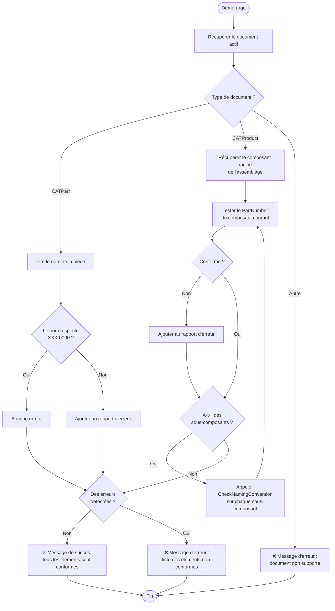

# Explication détaillée — `name_convention.vbs`

---

## Objectif de la macro

Cette macro vérifie que **chaque composant d'un fichier CATIA respecte une convention de nommage définie**. Elle s'applique aussi bien à une pièce seule (`.CATPart`) qu'à un assemblage complet (`.CATProduct`), en parcourant tous ses sous-composants de manière récursive.

La convention attendue est de la forme :

```
XXX-0000   →   3 lettres majuscules, un tiret, 3 ou 4 chiffres
Exemples valides   : ALU-123 / PAV-4521 / COQ-007
Exemples invalides : alu-123 / Part1 / PANNEAU_PORTE
```

---

## Déroulement global — étape par étape

### Étape 1 — `CATMain()` : point d'entrée

C'est la fonction appelée par CATIA au moment du lancement de la macro. Elle orchestre l'ensemble du processus :

1. **Récupère le document actif** dans la session CATIA.
2. **Détermine le type de document** :
   - **CATPart** → vérifie uniquement le nom de la pièce elle-même.
   - **CATProduct** → lance une vérification récursive sur tout l'arbre d'assemblage.
   - **Autre format** → affiche un message d'erreur et s'arrête immédiatement.
3. **Collecte les non-conformités** dans une variable `errorReport`.
4. **Affiche le résultat final** (voir Étape 3).

---

### Étape 2 — `CheckNamingConvention()` : le vérificateur récursif

Cette fonction est appelée uniquement lorsque le document est un assemblage (`.CATProduct`). Elle fonctionne selon le principe suivant :

```
Pour le composant courant :
    1. Tester son PartNumber contre le motif XXX-0000
    2. Si non conforme → l'ajouter au rapport d'erreur
    3. S'il a des sous-composants → appeler CheckNamingConvention sur chacun d'eux
```

La récursivité permet de descendre dans **tous les niveaux de l'arbre** d'assemblage, même imbriqués les uns dans les autres, sans que l'utilisateur n'ait à faire quoi que ce soit manuellement.

**Motif de validation utilisé :**

```
^[A-Z]{3}-\d{3,4}$
```

| Partie du motif | Signification |
|---|---|
| `^` | Début du nom (pas de caractère avant) |
| `[A-Z]{3}` | Exactement 3 lettres majuscules |
| `-` | Un tiret obligatoire |
| `\d{3,4}` | Entre 3 et 4 chiffres |
| `$` | Fin du nom (pas de caractère après) |

La comparaison est **sensible à la casse** : les minuscules sont rejetées.

---

### Étape 3 — Rapport final

Une fois tous les composants vérifiés, la macro affiche un message selon le résultat :

- ✅ **Aucune anomalie** → message de succès : tous les éléments sont conformes.
- ❌ **Anomalies détectées** → message d'erreur listant :
  - La convention attendue (rappel du format `XXX-0000`)
  - Le nombre total d'éléments non conformes
  - Le nom de chaque élément incriminé

---

## Organigramme



---

## Remarques importantes

- La macro **ne modifie rien** dans le modèle CATIA : elle est purement en lecture seule. Il n'y a aucun risque d'altérer le fichier.
- Elle fonctionne sur des assemblages de **n'importe quelle profondeur** grâce à la récursivité.
- La vérification porte sur la propriété `PartNumber` pour les assemblages et sur `Name` pour les pièces seules — ces deux champs correspondent au nom affiché dans l'arbre CATIA.
